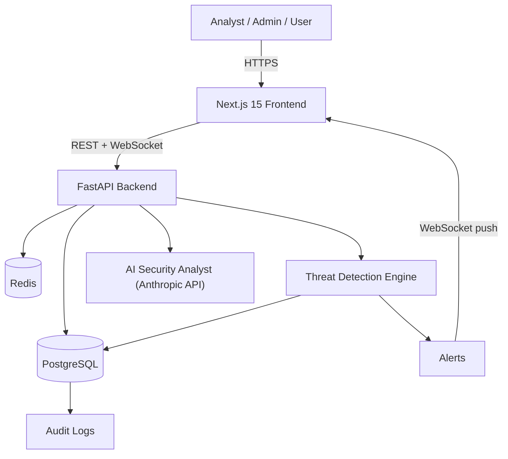

# Sentinel — Cloud Security & Threat Detection Platform

Sentinel is a full-stack security operations platform: it authenticates and manages users,
tracks every security-relevant action in an audit trail, automatically detects common attack
patterns, raises and manages alerts, and gives analysts an AI assistant that can explain and
summarize what it finds — all in real time.

## What problem does this solve?

Small and mid-sized engineering teams are frequently asked to run "security operations"
(monitor logins, catch brute-force attempts, investigate suspicious activity, keep an audit
trail for compliance) without the budget for an enterprise SIEM like Splunk or a full security
team. Sentinel is a self-hostable, open-architecture reference implementation of the core of
that workflow:

- **Admins** need to manage who has access to what, and prove it during an audit.
- **Security analysts** need to see logs and alerts in one place, investigate quickly, and
  record what they found.
- **Auditors / compliance reviewers** need read-only access to reports and history without
  being able to change anything.
- **Everyday users** just need to log in — and have that login be safe (hashed passwords,
  optional MFA, session control) without thinking about any of the above.

## Live features

| Area | What's implemented |
|---|---|
| **Authentication** | Registration, login/logout, JWT access + rotating refresh tokens, email verification, password reset, TOTP-based MFA, per-device session listing/revocation |
| **RBAC** | Four roles (Admin, Security Analyst, Auditor, User) → permissions → enforced on every protected endpoint via FastAPI dependencies |
| **Audit logging** | Every login, logout, password change, user create/update/delete, role change, and alert update is recorded with actor, IP, device, browser, and outcome |
| **Threat detection engine** | Rule-based detectors run inline on every login/API request: brute-force (N failed logins/IP/window), impossible travel (great-circle distance ÷ elapsed time between logins), API abuse (request-rate per IP) |
| **Alerts** | Auto-generated by the detection engine or created manually; severity (low/medium/high/critical), status workflow (open → investigating → resolved/dismissed), analyst notes |
| **Dashboard & analytics** | Live metrics (users, sessions, logins, security score, threat level), 7/14/30/90-day trend charts, category/severity breakdowns, filters, search, pagination, dark mode |
| **AI Security Analyst** | Natural-language Q&A backed by the real Anthropic API — grounded in the actual alerts/logs pulled from the database, not a canned response |
| **Real-time alerts** | WebSocket channel pushes new/updated alerts to every connected dashboard instantly |
| **Encryption** | Argon2id password hashing, AES-256-GCM for MFA secrets at rest, SHA-256 one-way hashing for opaque tokens (refresh/reset/verify), rate limiting on auth endpoints |
| **Infrastructure** | Docker Compose (Postgres, Redis, FastAPI, Next.js), Alembic migrations, GitHub Actions CI (lint + test + build for both services) |

## Target users

Security analysts and engineering/DevOps teams at organizations too small for a dedicated SIEM,
who want a self-hosted starting point they fully own and can extend — or anyone who wants a
concrete, working reference for how JWT auth, RBAC, audit logging, and rule-based threat
detection fit together in a real FastAPI + Next.js codebase.

---

## Architecture



### System overview

- The **frontend** never talks to the database directly — every action goes through the
  FastAPI REST API, authenticated with a short-lived JWT access token.
- The **threat detection engine** runs synchronously inside the request path for logins (brute
  force, impossible travel) and inside a middleware for every API call (rate/volume abuse) —
  when it fires, it writes an `Alert` row and broadcasts it over WebSocket to every open
  dashboard.
- **Redis** backs the rate limiter (shared across API replicas) so login/register throttling
  works correctly even if the API is scaled horizontally; it degrades gracefully to in-process
  limiting if Redis isn't reachable (e.g. local dev without Docker).
- The **AI Security Analyst** is not a chatbot with generic knowledge — every question is
  answered with real alerts/audit logs from the last 24 hours (and the specific alert in focus,
  if any) injected into the prompt, so answers are grounded in what actually happened on this
  deployment.

### Frontend architecture (`frontend/`)

Next.js 15 (App Router) + TypeScript + Tailwind CSS v4 + Recharts.

- `src/app/(auth)/*` — public pages (login, register, forgot/reset password, verify email).
- `src/app/(dashboard)/*` — protected pages behind a client-side auth guard: dashboard, alerts,
  audit logs, analytics, users, AI assistant, settings (MFA + sessions). Sidebar navigation is
  gated per-item by the current user's permissions (mirroring, not replacing, backend
  enforcement — the API is the real authority).
- `src/lib/api.ts` — typed fetch client with automatic access-token refresh on 401.
- `src/contexts/auth-context.tsx` / `theme-context.tsx` — global auth state and dark-mode toggle
  (persisted to `localStorage`, applied via a `dark` class + CSS custom properties so both
  themes are first-class, not an afterthought).
- `src/lib/use-alerts-socket.ts` — a small hook wrapping the `/ws/alerts` WebSocket for live
  alert badges/refreshes.

### Backend architecture (`backend/`)

FastAPI + SQLAlchemy 2.0 (async) + PostgreSQL + Redis + Alembic.

- `app/models/` — SQLAlchemy ORM models (`User`, `Role`, `Permission`, `AuditLog`, `Alert`,
  `Session`, `LoginAttempt`, `ApiRequestLog`, password-reset/email-verification tokens).
- `app/core/` — config (`pydantic-settings`), security primitives (Argon2, JWT, AES-GCM),
  RBAC permission dependencies, rate limiter, the API-activity logging middleware.
- `app/services/` — business logic: `auth_service` (registration/login/refresh/MFA/reset),
  `threat_detection` (the three detectors), `metrics_service` (dashboard/analytics
  aggregation), `ai_analyst` (Anthropic integration), `audit_service`, `geo` (IP → location,
  pluggable), `email_service` (console-logging stub — swap in SES/SendGrid for production).
  `request_meta.py` parses IP/device/browser off the request via [`user-agents`], used to
  populate every audit log entry.
- `app/api/v1/` — one router per resource (`auth`, `users`, `logs`, `alerts`, `dashboard`, `ai`,
  `ws`), each endpoint declaring its required permission via a FastAPI dependency
  (`require_permissions(...)`).
- `app/ws/manager.py` — an in-process WebSocket connection registry used to broadcast alert
  events to every connected dashboard.

### Database architecture

PostgreSQL via SQLAlchemy's async engine, versioned with Alembic (`backend/alembic/`). Roles
and permissions are many-to-many (`role_permissions`); every table uses a UUID primary key and
a `created_at` timestamp. See `app/models/` for the full schema — key tables:

- `users` (email, password_hash, role_id, mfa fields, threat_score, last_login_*)
- `roles` / `permissions` / `role_permissions`
- `audit_logs` (user, action, category, status, ip, device, browser, details, timestamp)
- `alerts` (severity, category, description, user, source_ip, status, notes)
- `sessions` (hashed refresh token, device/IP, expiry, revoked flag — enables per-device logout)
- `login_attempts` (success/failure, ip, geolocation, failure_reason — feeds the detectors)
- `api_request_logs` (method, path, status, duration — feeds the API-abuse detector)

### RBAC model

```
User → Role → Permission → Allowed Action
```

| Role | Can do |
|---|---|
| **Admin** | Everything: manage users/roles, view all security data, manage alerts, view logs/reports/analytics |
| **Security Analyst** | View users & logs, investigate threats, manage incidents/alerts, view analytics |
| **Auditor** | View reports, logs, and analytics (read-only) |
| **User** | Standard application access only |

The full permission matrix is defined once, in code, at `backend/app/core/permissions.py`, and
seeded into the database by `backend/app/db/seed.py` — so it's inspectable at runtime but has a
single source of truth.

---

## Tech stack

**Frontend:** Next.js 15, React 19, TypeScript, Tailwind CSS v4, Recharts
**Backend:** FastAPI, PostgreSQL, SQLAlchemy 2.0 (async), Alembic, Redis
**Security:** JWT + rotating refresh tokens, RBAC, Argon2id, AES-256-GCM, TOTP MFA (`pyotp`),
Redis-backed rate limiting (`slowapi`)
**Infra:** Docker, Docker Compose, GitHub Actions CI
**Realtime:** WebSockets · **Docs:** OpenAPI/Swagger at `/docs`

---

## Getting started

### Option A — Docker Compose (recommended)

```bash
cp backend/.env.example backend/.env
# Edit backend/.env — at minimum set SECRET_KEY / AES_ENCRYPTION_KEY to real random values,
# and ANTHROPIC_API_KEY if you want the AI Security Analyst to work.

docker compose up --build
```

- Frontend: http://localhost:3000
- Backend API + Swagger docs: http://localhost:8000/docs
- On first boot, the backend container runs Alembic migrations and seeds the four RBAC roles
  plus a first admin user (`FIRST_ADMIN_EMAIL` / `FIRST_ADMIN_PASSWORD` from `.env`, default
  `admin@sentinel.internal` / `ChangeMe123!` — **change this in any real deployment**).

### Option B — Run locally without Docker

**Backend:**
```bash
cd backend
python3.12 -m venv .venv && source .venv/bin/activate
pip install -r requirements.txt
cp .env.example .env   # then point DATABASE_URL at a local Postgres, or use SQLite for a quick spin:
#   DATABASE_URL=sqlite+aiosqlite:///./dev.db
alembic upgrade head
python -m app.db.seed
uvicorn app.main:app --reload
```

**Frontend:**
```bash
cd frontend
npm install
echo "NEXT_PUBLIC_API_URL=http://localhost:8000" > .env.local
npm run dev
```

### Running tests

```bash
cd backend
source .venv/bin/activate
pytest -q          # 21 tests: auth, RBAC enforcement, threat detection, crypto primitives
ruff check app tests
```

```bash
cd frontend
npm run lint
npm run build
```

---

## Security notes & honest limitations

This is a portfolio/reference-depth implementation of a real architecture, not a
penetration-tested production deployment. Before using it for anything real:

- **Rotate the default secrets.** `SECRET_KEY`, `AES_ENCRYPTION_KEY`, and the seeded admin
  password are development placeholders in `.env.example` — never deploy with them unchanged.
- **IP geolocation is mocked.** `app/services/geo.py` uses a small deterministic offline
  resolver (a handful of named demo cities + a stable hash fallback) so impossible-travel
  detection is demoable without a paid geolocation API or MaxMind database. Swap in a real
  provider before relying on this for actual incident detection.
- **Email is stubbed.** Verification/reset emails are logged to the backend console, not
  actually sent — wire up SES/SendGrid/Postmark in `app/services/email_service.py` for
  production use.
- **The threat detection engine is rule-based, not ML-based.** That's a deliberate choice for
  explainability (every alert can point at exactly which rule fired and why), but it means it
  won't catch anything more sophisticated than the three implemented patterns.
- **No production TLS termination, WAF, or infrastructure hardening is included** — this repo
  is the application layer; a real deployment needs a reverse proxy (e.g. Caddy/nginx/ALB) with
  TLS, and the AWS/cloud deployment topology described above is a target architecture, not
  something this repo provisions for you.

## Roadmap ideas (not implemented)

- Automated incident-report export (PDF/CSV)
- SSO / OAuth login
- Per-tenant multi-org support
- ML-based anomaly scoring alongside the rule-based engine
